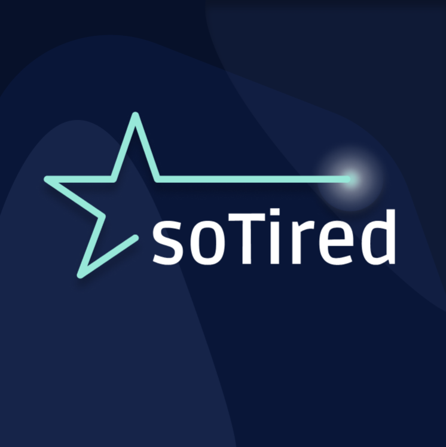

<div align="center">
  
</div>

## Motivation
soTired is an application for cognitive fatigue assessment.
It includes a stand-alone Android app for fatigue detection and an additional part for data 
management and further analysis. The project is structured as client side (stand-alone app) 
implemented in Dart/Flutter and a server side (data management) written in Golang.
Besides Android, Dart/Flutter provides the ability to add an iOS, desktop and / or web application 
from a single codebase.

soTired is a rewrite of the application presented in the 
[Validation of a Smartphone-Based Approach to In Situ Cognitive Fatigue Assessment](https://mhealth.jmir.org/2017/8/e125) 
paper by Edward Price, George Moore, Leo Galway and Mark Linden.

## How to contribute
PRs are very welcome! :)  
You can set up your development environments following the steps below.

### App development environment setup
1. Make sure you have flutter (version `2.5.0` or higher) installed and `flutter doctor -v` does not have any 
errors regarding Android development.
1. Clone the repository and run `cd soTired/ && make init` to initialize git pre-commit hooks.
1. Inside the `soTired/` directory run `make flutterPubGet` to install all depending packages.

### Server development environment setup
1. Make sure you have go (version `1.17` or higher) installed.
1. Clone the repository and run `cd soTired/ && make init` to initialize git pre-commit hooks.
1. Inside the `soTired/server/` directory run `go install` to install all requirements.

You're good to go now :)  
NOTE: Check the `Makefile` for useful commands regarding the app and also the server part.

## How to install the app
1. Make sure you have `adb` installed (or something similar to install the app). *(The lowest Android 
version supported is version `9.0` (API level 28).)*
1. Download the official release ([here](https://github.com/teamulster2/soTired/releases)) or build 
it yourself by running `make flutterBuild` in the root directory of the project. Note that you need to 
set up your development environment first.

## How to set up the server
1. After setting up the server development environment run `cd soTired && make gobuild` to build the 
server.
1. By then typing `cd server && ./soti-server` you will be displayed the server help. Follow these 
instructions to start the server.

## Contributions
For communication through the code, please use one of the following tags:
```
FIXME - for a bug which can't be fixed now
TODO - for a feature or are a design change that has to be done later on
NOTE - for an important information
```

The git workflow for this repo is **rebase-merge**, which results in a history of this form:

```
                             F--G
                            /    \
   feature-1 ->     B--C   E------H    <- feature-2
                   /    \ /        \
                --A------D----------I  <-main

```
In conclusion, the main branch only contains merge commits from other branches,
which are rebased onto the most recent commit.

## Documentation
For further information please refer to the app's [report](https://github.com/teamulster2/report).
